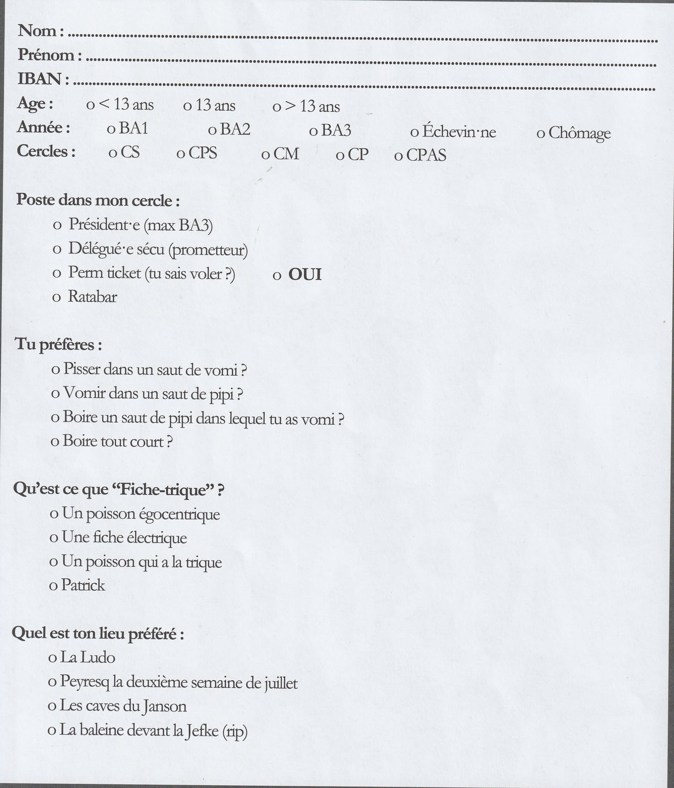

  
    

# Suite à venir, chaque chose en son temps...

#  De l'origine : 
C'est probablement dans la continuité des **Nébuleux** et des **Sauriens** (alors en voie d'extinction) qu'émerge, après la Première Guerre mondiale, l'**Ordre des Frères Macchabées**. 

Autrefois connus sous le nom de Funèbre Macchabées, ils adoptèrent cette appellation en hommage aux frères d’armes ayant côtoyé la mort de près dans les tranchées. Un article du Soir de 1999 rapporte que des étudiants envoyés au combat furent approchés par des Maçons, qui leur transmirent les rites et l’esprit de fraternité maçonnique afin de rendre plus paisible leurs vie dans les tranchées.

Cet esprit fut par la suite intégré à l’ULB, donnant naissance à ce qui est probablement – bien que les sources divergent – l’un des ordres ayant perduré le plus longtemps, en dehors des cercles facultaires.

# De l'Ordre
## Le Symbolisme
L'Ordre adopte un rituel riche et un vocabulaire distinct, marqué par l'antiphrase, le macabre et l'anticléricalisme, donnant ainsi naissance à un langage codé.

Gràce au Frère Chassepot ayant consacré un article dans "La pensée des Hommes" et aux archives de l'ULB, nous pouvons citer en exemple de ce vocabulaire les jours de la semaine tel que **Baisedi, Boiredi, ...** ou encore les mois de l'année tel que **Busidor, Vinéal, ...**
Ainsi le profane est souvent désigné comme **"vif"** en opposition aux membres **"défunts"** et les texte en internes prennent des tournures inverse du type : 
> la prochaine tenure n'aura pas lieu tel jour ou la présence des Frères n'est pas souhaitée ...   
> **équivaut à** : La prochaine réunion aura lieux tel soir en souhaitant la présence des Frères

Nous pouvons aussi citer par exemple la hiérarchie organiser en un comité dit **Synodes** (assemblée délibérative d'ecclésiastiques) de 13 membres (nombre sacré) séparé en **"officiers dignitaires"** :
- **Grand Maitre** : [X]
- **Antiseptique Injecteur** : chargé du ravitaillement de **"boisson corrosive"**.
- **Méticuleux Gardien des Rites** : chargé du respect de la tradition et du règlement.
- **Talentueux Graphiste** : chargé de transcrire poèmes et chansons.
- **Mélodieux Barde** : chargé de l'accompagnement musical.
- **Hermétique Pylore** : chargé de la surveillance et de la porte d'entrée.

et en **"officiers supérieur"** : 
- **Laborieux Grand Greffier** : chargé secrétaire.
- **Très Redoutable Grand Inquisiteur** : chargé discipline.
- **Très Redoutable Grand Harpagnon** : chargé trésorerie.
- **Cruel Exécuteur des Hautes Oeuvres**: chargé de faire respecter la justice

> 📖 **Du XIII** : Repris des Nébuleux et probablement issus de beaucoup d'autres ordre de la même envergure tel que les "Skull and Bones" de Yale, dans la numérologie il est fortement lié à l'anti clérical dans la culture occidentale sauf en Italie où il porte chance.
## Le Recrutement 
L'intégration au sein de l’ordre se fait par cooptation, où chaque nouveau membre doit satisfaire des critères stricts établis par les anciens afin de garantir la cohésion du groupe.
Le premier contact s’établit généralement par une lettre ou un appel téléphonique anonyme. À cette occasion, il est fréquent que le candidat reçoive pour consigne de se bander les yeux et d’attendre sur un banc de l’abbaye de la Cambre.
Ensuite, les postulants sont soumis à une enquête approfondie ainsi qu’à un interrogatoire portant sur leur parcours dans le milieu étudiant. Avant l’intronisation, un vote des membres de l’ordre détermine leur admission à l'intronisation.

> **Image à paraître**

Il est néanmoins possible de candidater en remplissant un formulaire disponible derrière chaque "Bruxelles Universitaire". Cette méthode est probablement un canular, mais elle fait également écho aux origines de l’ordre, qui était autrefois plus ouvert et autorisait ce type de candidature jusqu’aux années [X].

> Candidature issue du BU Saint-V 2024 / Saint-V CVII.  
> Réponse sous les 13 jours (naturellement)  
> À soumettre en 3 exemplaires de façon discrète mais pas secrète sur :
> - L'arbre en face du Pint House
> - L'arbre en face du CM
> - L'arbre en face de la Jefke  

## Le Rôle de l'Ordre dans le Folklore

# Sources : 
- Article du journal le Soir de 1999 : "A LA UNE LES CERCLES DU VOIR, DU SAVOIR ET DU POUVOIR..."
-  "La pensée des Hommes - Sous le masque de la franc-maçonnerie", 13e ouvrage.
