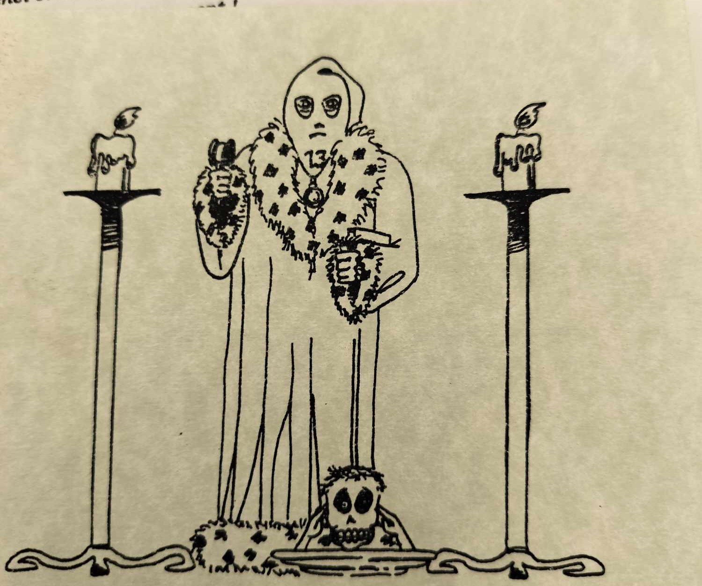
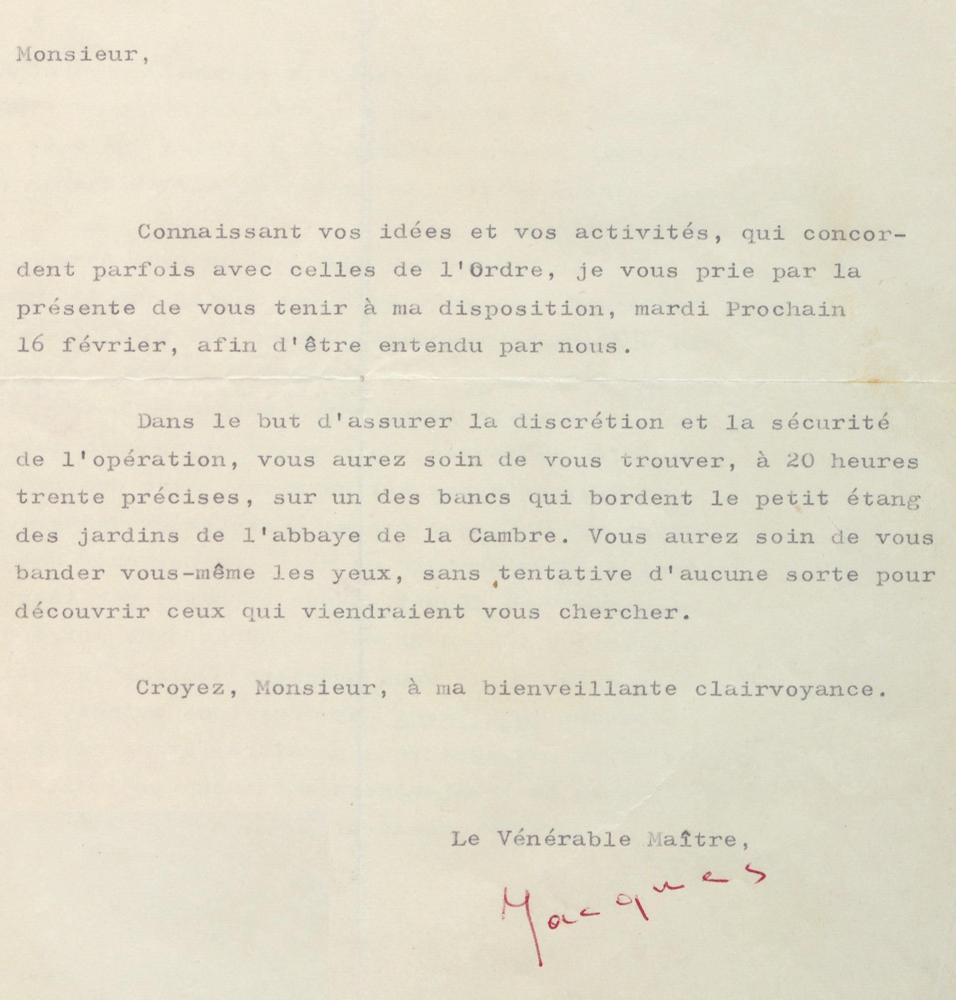

# De l'Origine : 
C'est probablement dans la continuité des **Nébuleux** et des **Sauriens** (alors en voie d'extinction) qu'émerge, après la Première Guerre mondiale, l'**Ordre des Frères Macchabées**. 

Autrefois connus sous le nom de Funèbre Macchabées, ils adoptèrent cette appellation en hommage aux frères d’armes ayant côtoyé la mort de près dans les tranchées. Un article du Soir de 1999 rapporte que des étudiants envoyés au combat furent approchés par des Maçons, qui leur transmirent les rites et l’esprit de fraternité maçonnique afin de rendre plus paisible leurs vie dans les tranchées.

Cet esprit fut par la suite intégré à l’ULB, donnant naissance à ce qui est probablement – bien que les sources divergent – l’un des ordres ayant perduré le plus longtemps, en dehors des cercles facultaires.

# De l'Ordre
À l'origine, l'ordre était **exclusivement masculin**. Bien que marqué par un **élitisme** dès sa création, une partie des réunions restait accessible à l’ensemble de la communauté universitaire, conformément à la tradition Nébuleuse. Ce n’est qu’en 1931 que l’ordre choisit de basculer dans le **secret**. De plus, sous la pression de l'ULB, de nombreux ordres masculins ont été contraints d'ouvrir leurs portes à leurs équivalents féminins par souci d'équité, bien que l'inverse ne se soit pas produit. C'est ainsi qu'en 1981, la première **Grande Maîtresse** a été désignée.

## Le Symbolisme
L'Ordre adopte un rituel riche et un vocabulaire distinct, marqué par l'antiphrase, le macabre et l'anticléricalisme, donnant ainsi naissance à un langage codé.

Grâce au Frère Chassepot ayant consacré un article dans "La pensée des Hommes" et aux archives de l'ULB, nous pouvons citer en exemple de ce vocabulaire les jours de la semaine tel que **Baisedi, Boiredi, ...** ou encore les mois de l'année tel que **Busidor, Vinéal, ...**
Ainsi le profane est souvent désigné comme **"vif"** en opposition aux membres **"défunts"** et les texte en internes prennent des tournures inverse du type : 
> la prochaine tenure n'aura pas lieu tel jour ou la présence des Frères n'est pas souhaitée ...   
> **équivaut à** : La prochaine réunion aura lieux tel soir en souhaitant la présence des Frères

Nous pouvons aussi citer par exemple la hiérarchie organiser en un comité dit **Synodes** (assemblée délibérative d'ecclésiastiques) de 13 membres (nombre sacré) séparé en **"officiers dignitaires"** :
- **Grand Maitre** : [X]
- **Antiseptique Injecteur** : chargé du ravitaillement de **"boisson corrosive"**.
- **Méticuleux Gardien des Rites** : chargé du respect de la tradition et du règlement.
- **Talentueux Graphiste** : chargé de transcrire poèmes et chansons.
- **Mélodieux Barde** : chargé de l'accompagnement musical.
- **Hermétique Pylore** : chargé de la surveillance et de la porte d'entrée. Le pylore est la partie de l'estomac qui contrôle le passage des aliments vers l'intestin grêle.

et en **"officiers supérieur"** : 
- **Laborieux Grand Greffier** : chargé secrétaire.
- **Très Redoutable Grand Inquisiteur** : chargé discipline.
- **Très Redoutable Grand Harpagnon** : chargé trésorerie. Harpagons est un personnage de Molière issus de la pièce "L'avare", de nature avare et cupide.
- **Cruel Exécuteur des Hautes Œuvres**: chargé de faire respecter la justice

> 📖 **Du XIII** : Repris des Nébuleux et probablement issus de beaucoup d'autres ordre de la même envergure tel que les "Skull and Bones" de Yale, dans la numérologie il est fortement lié à l'anti clérical dans la culture occidentale sauf en Italie où il porte chance.

Pendant leurs tenures, les frères revêtent une toge et une cagoule noires. La réunion se déroule dans un lieu gardé secret, éclairé à la seule lueur des bougies. Un crâne, symbole de puissance souveraine plutôt que de memento mori, repose sur un autel recouvert de draperies noires.

> Ici une image de la fanfare du cercle de Médecine lors de la Saint-V de 1931. Cependant, nous pouvons apercevoir Jefke pointer gaiement sa tête parmi les membres. Notons aussi la présence d'un clystère, souvent utilisé dans la symbolique des premiers ordres et cercles.

## Le Recrutement
L'intégration au sein de l’ordre se fait par cooptation, où chaque nouveau membre doit satisfaire des critères stricts établis par les anciens afin de garantir la cohésion du groupe.
Le premier contact s’établit généralement par une lettre ou un appel téléphonique anonyme. À cette occasion, il est fréquent que le candidat reçoive pour consigne de se bander les yeux et d’attendre sur un banc de l’abbaye de la Cambre.
Ensuite, les postulants sont soumis à une enquête approfondie ainsi qu’à un interrogatoire portant sur leur parcours dans le milieu étudiant. Avant l’intronisation, un vote des membres de l’ordre détermine leur admission à l'intronisation.

> Lettre datée du 10 février 1965, retrouvée dans les archives de l'ULB

Il est néanmoins possible de candidater en remplissant un formulaire disponible derrière chaque "Bruxelles Universitaire". De nos jours, cette méthode est sans doute une supercherie. Toutefois, elle rappelle les origines de l’ordre, qui était autrefois plus accessible et acceptait ce mode de candidature jusqu’en 1928.

> Candidature issue du BU Saint-V 2024 / Saint-V CVII.  
> Réponse sous les 13 jours (naturellement)  
> À soumettre en 3 exemplaires de façon discrète mais pas secrète sur :
> - L'arbre en face du Pint House
> - L'arbre en face du CM
> - L'arbre en face de la Jefke  

## Le Rôle de l'Ordre en Interne et dans le Folklore

Le but de l'Ordre était de promouvoir avant tout un groupe construit sur la **camaraderie** estudiantine, afin de **défendre les traditions** estudiantines et les valeurs de l'ULB, comme le libre examen et la liberté d'expression tout en écartant de l'ULB les étudiants issus de l'enseignement clérical.

Dans cette optique, nous retrouvons souvent lors d'évènement marquant des tracts et des affiches terminées par “Si la communauté universitaire ne réagit pas, les Macchas, eux, réagiront” mais aussi  la parution de journaux tel que la "**Bulle**" ou encore le "**Bruxelles Universitaire**".

Au sein de l’Ordre, les frères macchabées sont généralement tenus de produire un travail à chaque tenure. Celui-ci peut revêtir une dimension artistique, à travers une chanson, un poème ou une caricature, ou s’inscrire dans une démarche plus analytique, sous forme de dissertation, de réflexion ou de débat sur le folklore. De plus, en raison du caractère élitiste de l’Ordre et de son souhait de recruter principalement des individus bien intégrés dans un cercle, il est attendu des frères qu’ils participent activement à la vie estudiantine, que ce soit au sein de leur propre cercle ou du cercle du Libre Examen. Un article du "Bruxelles Universitaire" de 1928 exprime bien cette dernière volonté : 

Tout ce rituel ne prétend ni imiter ni tourner en dérision la franc-maçonnerie. Cependant, l’idée d’**antichambre** est souvent évoquée à propos de l’ordre. En effet, il n’est pas rare qu’un frère, après avoir quitté la vie universitaire, finisse par rejoindre une loge, comme l’explique Chassepot :
 
> [...] mais j'ai ressenti une profonde joie à retrouver en loge un grand nombre de mes anciens compagnons de la vie universitaire.

# Quelle Pertinence ?

> 💡 Cette section reflète une réflexion personnelle propre à son auteur. Son objectif n'est pas de viser une personne ou un groupe en particulier, mais plutôt de poser des questions sur la pertinence du sujet et d'apporter des arguments, bien que rarement inédits, à un débat ouvert. Chaque avis a sa pertinence, et bien que le support actuel soit inadéquat, presque toute parole mérite d’être entendue.

L’ordre des Frères Macchabées semble aujourd’hui en proie à une crise d’identité dont les racines plongent dans son histoire même. Malgré des tentatives de renouveau, il demeure marqué par des travers hérités d’un autre temps, notamment un élitisme anachronique et une fermeture qui entrave son adaptation aux évolutions contemporaines. Cette tension entre tradition et modernité pose la question de la viabilité de l’ordre dans un contexte où les attentes sociétales et universitaires ont profondément changé.

Tout d’abord, l’origine même de l’ordre constitue un frein à son évolution. Fondé dans un contexte où l’entre-soi et le prestige tenaient une place centrale, il peine à se détacher d’une image d’élitisme figé, souvent perçue comme caractéristique d’une aristocratie étudiante du début du XXe siècle. Bien que des efforts aient été faits pour moderniser son image, ces tentatives se heurtent à une forme d’arrivisme qui continue de façonner les dynamiques internes et externes du groupe. Ainsi, l’ordre semble osciller entre une volonté de se renouveler et l’incapacité de se défaire de ses propres fondements.

Ensuite, le poids des traditions folkloriques constitue un autre obstacle à cette modernisation. L’attachement à des rituels anciens, bien que porteur d’une identité forte, rend difficile une adaptation cohérente aux enjeux actuels. Comment concilier la défense d’une nouvelle image du semeur avec la nécessité de préserver celle d’antan ? Cette contradiction illustre les dilemmes auxquels l’ordre est confronté : préserver une histoire prestigieuse tout en répondant aux exigences d’une époque où le folklore universitaire se veut repensé.

À cela s’ajoute une forme de biais politique qui tend parfois à prévaloir sur le principe du Librex, pourtant essentiel au sein de notre alma mater. Cette dérive se manifeste notamment par l’exclusion implicite, voire explicite, d’anciens frères dont les opinions s’écartent des sensibilités dominantes. Dès lors, une contradiction émerge : comment un ordre censé promouvoir la discrétion et le Libre Examen peut-il justifier une forme de censure, s’appuyant sur des arguments d’autorité et des biais idéologiques, plutôt que sur un véritable débat d’idées ?Serait-elle le fruit d’une crainte du regard du public sur des propos tenus en tenure ? Mais alors, pourquoi accorder tant d’importance à cette perception extérieure lorsqu’on revendique la discrétion comme principe fondamental ? Cette apparente contradiction soulève une problématique plus large, celle de la discrétion.

La question de la discrétion de l’ordre ajoute une complexité supplémentaire. Si autrefois une certaine ouverture caractérisait le cercle, une évolution vers une posture plus discrète a été observée. Toutefois, cette discrétion semble parfois factice lorsque les statuts mêmes de l’ordre imposent une posture de défiance visible à l’égard des événements majeurs de l’institution universitaire. Peut-on réellement se dire discret lorsqu’une réputation de groupe marginalisé et provocateur est revendiquée ? En jouant sur l’image du rejet institutionnel – « tout le monde hait les MAKB » – l’ordre entretient paradoxalement une visibilité qui contredit son positionnement officiel.

En conclusion, l’Ordre des Frères Macchabées se trouve à la croisée des chemins, tiraillé entre une tradition pesante et la nécessité d’une adaptation aux réalités contemporaines. Son élitisme historique, son attachement à des rituels anciens et les tensions idéologiques qui traversent actuellement notre alma mater constituent autant d’obstacles à son renouveau. La discrétion qu’il revendique apparaît paradoxale, oscillant entre retrait et mise en scène assumée. Dès lors, la viabilité de l’ordre repose sur sa capacité à redéfinir son identité sans renier son héritage, sous peine de sombrer dans une marginalité de plus en plus détachée des évolutions universitaires et sociétales.

Par sympathie,

Lövbacken

# Sources : 
- Article du journal le Soir de 1999 : "A LA UNE LES CERCLES DU VOIR, DU SAVOIR ET DU POUVOIR..."
- Article du journal le Soir de 1979 : ""
- Bruxelles Universitaire Saint-V 2024 :
- Bruxelles Universitaire Janvier 1928 : 
- "La pensée des Hommes - Sous le masque de la franc-maçonnerie", 13e ouvrage.
- Archives de l'ULB.

