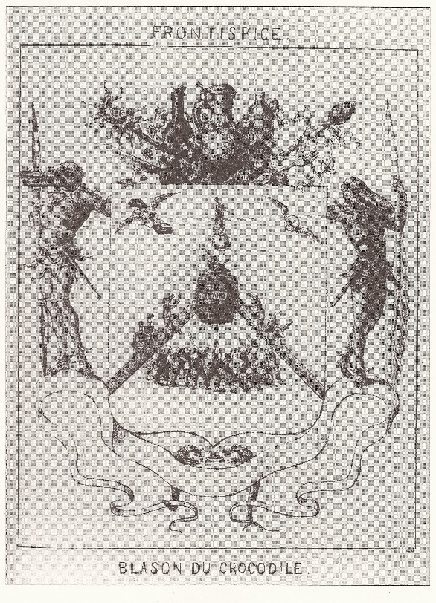

# De l'Ordre :

L' **Ordre du Faro** est une confrérie gastronomique bruxelloise dédiée à la préservation et à la promotion des bières artisanales à fermentation spontanée de la vallée de la Senne. Parmi celles-ci figurent le lambic, la gueuze, la kriek, le faro et bien d'autres trésors brassicoles.

Fondé le **6 décembre 1980**, l'Ordre du Faro trouve ses origines dans un cercle d’étudiants et d’anciens étudiants qui se réunissaient au Bon Père Faro. Rapidement, la confrérie gagne en notoriété grâce à son association avec la Société des Agathopèdes (nous en parlerons plus bas), qui contribue à sa mise en avant. Cette relation particulière est évoquée dans le texte "Histoire de la naissance de notre confrérie d’après Betty de Nil", où l’on peut lire :

> Il était une fois deux copains, Michel DAVID et Charles FONTAINE de GHELIN, l’un cuisinier de son état et membre de l’ association des « Agathopèdes », l’autre patron du bistrot « Père Faro » chaussée d’Alsemberg à Uccle et grand collectionneur d’articles de bières. Michel DAVID nous contacta, Marcel DEDOBBELEER et moi-même dans le courant de l’année 1980 pour nous informer de leur souhait de créer une confrérie défendant la bière bruxelloise [...]

Aujourd’hui, l’Ordre du Faro est devenu une ASBL reconnue par le Conseil Noble Bruxelles Brabant (CNBB) et rassemble une vingtaine de membres actifs. Bien que son existence ait pu sembler marquée par le temps, l’Ordre a récemment suscité l’intérêt des étudiants à tendance ordinesque, entraînant un rajeunissement notable de ses membres.

# Du Lambic et de ses variations :
Cette section, bien que légèrement en marge du sujet principal de l'article, vise à apporter un éclairage sur les valeurs défendues par l'Ordre du Faro. Elle s'inscrit donc davantage comme un complément d'information que comme un élément directement essentiel au propos initial.

## Le Lambic : Une Bière à Fermentation Spontanée
Le lambic est une bière à **fermentation spontanée,** exclusivement produite dans la vallée de la Senne (au sud de Bruxelles) et dans le Pajottenland (à l’ouest de Bruxelles). Brassé en hiver, il est exposé à l’air libre durant une nuit afin d’être ensemencé par des bactéries et des levures sauvages, notamment Brettanomyces bruxellensis et Brettanomyces lambicus.

Après cette phase d’ensemencement, le lambic est généralement vieilli en fût ou en bouteille pendant une période variant entre 3 et 9 mois, donnant naissance à différentes déclinaisons :

- **Lambic jeune** (environ 3 mois) : saveur légère, faible teneur en alcool, riche en levures actives.
- **Lambic vieux** (environ 9 mois) : goût plus prononcé, teneur en alcool d’environ 5 %, faible activité levurienne.
- **Lambic mi-vieux** : sans définition précise, son vieillissement est laissé à l’appréciation du brasseur.

## La Gueuze : Un affinage de lambics 

La gueuze est le résultat d’un **assemblage** de lambic jeune et vieux, permettant d’obtenir un équilibre entre une bonne capacité de fermentation et une teneur en alcool suffisante. Une fois assemblée, la bière est mise en bouteille où elle subit une seconde fermentation durant environ un an.

Souvent surnommée le « champagne de la bière », la gueuze doit cette comparaison à l’utilisation de bouteilles similaires à celles du champagne ainsi qu’à l’assemblage de plusieurs millésimes, qui lui confère une complexité aromatique unique, surtout reconaissable par son acidité.

## Le Faro : de bière d'étudiants à bière oubliée

Le faro est un lambic adouci par l’ajout de sucre candi brun, qui lui confère une saveur légèrement caramélisée. Autrefois, il s’agissait de la manière la plus courante de consommer le lambic et était très prisé dans les millieux estudiantins. En effet  les références dans les chants et blasons ne sont pas rares : 

> Elle a vraiment d’une bière flamande  
L’air avenant, l’éclat et la douceur  
Joyeux Wallons, elle nous affriande  
Et le **Faro** trouve en elle une sœur  

Cependant, avec le succès croissant de la pils, ainsi que le développement de la gueuze et de la kriek – facilité par l’amélioration de la solidité des bouteilles et l’adoption des bouteilles de champagne – le faro a progressivement décliné, au point de presque disparaître.

Cette bière doit être consommée rapidement, car le sucre candi relance la fermentation, limitant ainsi sa durée de conservation. Malgré cette contrainte, quelques brasseurs proposent encore aujourd’hui du faro en bouteille tel que Lindemans, Timmermans ou encore Boon.

> Nous parlerons un jour de l'ordre des Crocodiles...

## La Kriek et autres bières fruitées artisanalles
Tout comme le faro, un lambic peut être adouci par l'ajout d'un ou plusieurs fruits. Selon le profil gustatif recherché, on peut utiliser un lambic jeune, qui donnera une bière plus douce et fruitée, ou un lambic vieux, dont l'acidité prendra le dessus et atténuera la présence du fruit.

Ainsi, avec un lambic jeune, on obtient des bières fruitées et sucrées, à l'image de celles produites par la brasserie Lindemans, comme :

- Kriek
-  Pecheresse
-  Framboise
-  etc.

À l'inverse, en utilisant un lambic vieux, on se rapproche davantage d’une gueuze, où l’acidité domine et le fruit devient plus subtil. Parmi ces bières, on retrouve :

- La Foufoune (Cantillon) : abricot
- La Rosée de Gambrinus (Cantillon) : framboise
- La Oude Kriek (Lindemans) : cerise
- etc.

## Les Brasseries et Gueuzeries
Comme mentionné précédemment, toute brasserie souhaitant brasser et assembler des lambics est soumise à une réglementation stricte concernant son emplacement. Il est toutefois important de distinguer les brasseries, qui produisent directement du lambic, des gueuzeries, qui se consacrent exclusivement à l’achat, l’assemblage et l’affinage des lambics pour créer de nouveaux produits.

Parmi les brasseries les plus connues, on peut citer :

- Lindemans
- Cantillon
- Boon
- Drie Fonteinen
- Timmemans
- ...

Tandis que parmi les gueuzeries, on retrouve :

- Oude Beersel
- Hanssens
- Tilquin
- ...

# Des Agathopèdes :

## Une société curieuse 
La **Société Pantechnique et Palingénésique des Agathopèdes**, plus communément appelée **Société des Agathopèdes**, est une société discrète fondée à Bruxelles le 24 septembre 1846 par Antoine Schayes. Elle se présente comme le prolongement de l' **Ordre des Agathopèdes**, supposément établi au XVe siècle et disparu vers la fin du XXe siècle.

Le premier Ordre des Agathopèdes était  vraisemblablement une **pure mystification**. Selon cette légende, cette société secrète aurait été fondée à Bruxelles au milieu du XVe siècle dans le but de lutter contre le fanatisme religieux, d'abord celui de l'Église catholique romaine, puis celui des Églises protestantes. Cette mystification fut peut-être élaborée pour donner un vernis d'authenticité et d'ancienneté à la plus moderne Société des Agathopèdes.

Depuis sa création, la Société des Agathopèdes entretient des liens étroits avec la **Société des Douze**, une confrérie alliant gastronomie et érudition, qui a compté parmi ses membres plusieurs fondateurs de l'Université libre de Bruxelles (ULB).

## Une reprise étrange
Le 29 septembre 1846, Antoine Schayes restaure l’Ordre des Agathopèdes. Le premier chapitre de cette nouvelle société se tient le 4 novembre de la même année.

À l’origine, la Société des Agathopèdes est composée de sept membres, tous érudits brillants, désireux de se divertir de manière honorable en associant gastronomie et création de canulars. Ses membres s’engagent à être de fidèles compagnons, et ses statuts précisent que l’objectif de l’association est de « passer les soirées à l’abri des mouchards, du bruit, de la musique et autres incommodités ».

Bien que fondée dans un esprit de légèreté et de plaisanterie, cette société de joyeux esprits acquiert rapidement une réputation prestigieuse dans le domaine culturel, notamment grâce aux ouvrages de grande qualité publiés sous son nom, encore très prisés des bibliophiles aujourd’hui.

## Une fin tragique 
D'après le témoignage de Betty de Nil, la société des Agathopèdes semble s'éteindre dans les années 1980. Voici ce qu'elle déclare : 

> Nous formions une équipe dynamique et soudée et tout commençait à aller pour le mieux lorsque nous apprîmes que l’association des « Agathopèdes » n’était qu’une vaste escroquerie aux restaurateurs. Notre réaction fut de nous dissocier de nos parrains peu scrupuleux. Notre Grand Maître Michel DAVID, à notre grande surprise et à notre plus grand regret, opta pour les « Agathopèdes » (sous leur pression, je pense) et démissionna de sa fonction au sein de notre confrérie. Nous avons néanmoins gardé les meilleurs contacts avec Michel que nous avons toujours regretté car c’était un homme chaleureux, sincère et intègre. Quant aux « Agathopèdes » ils disparurent définitivement peu de temps après.

Ainsi les Agathopèdes, ayant eu des contacts avec l'Ordre du Faro, auraient soit constitué l'une des dernières interactions des Agathopèdes réformés de 1858 (parfois appelés Néo-Agathopèdes), soit fait partie d'un groupe usurpateur se basant sur la renommée de cette société.

# Sources : 
- Gaston de le Court, Les Agathopèdes, Bruxelles 1846 - 1853, dans les Annales de la société royale d'Archéologie de Bruxelles, tome 49
- http://www.confreries.be/CNBB/conf/faro/index.htm
- Histoire de la naissance de notre confrérie d’après Betty de Nil
- Sainte-Beuve et la critique littéraire contemporaine, Librairie Droz, 1972