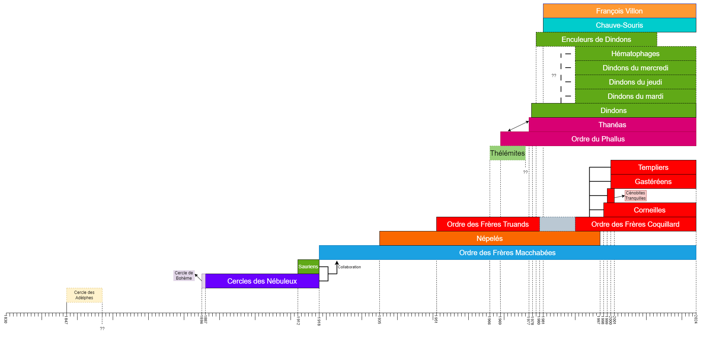

> ⚠️ Cet article fait office de table des matières pour les articles existant ou à venir sur le site.

# Cercle des Adelphes

# Cercle de Bohème - Cercle des Nébuleux

["Les Nébuleux : Aux Origines des Ordres et de Leurs Influences Secrètes"](/posts/nébuleux/)

# Sauriens

["Les Sauriens : une société perdue dans les archives"](/posts/sauriens/)

# Ordre des Frères Macchabées

["L'OFFMAKB : une histoire riche en perte de pertinence depuis plus de 20 ans..."](/posts/OFFMAKB/)

# Cercle des Népelés 

# Des Truands aux Coquillards : une grande famille

## Les Frères Truands et les Frères Coquillards

[Des Truands aux Coquillards : le contrepoids de l'influence Macchabée](/posts/truands/)

## Corneilles et Templiers

## Cénobites Tranquilles

## Gastéréens

# Thélémites

# Phallus et Thanéa
[Phallus et Thanèa : les ordres dans l'après mai 68](/posts/phallus/)

# Les Dindons et leurs déscendances

## Dindons

## Enculeurs de Dindons

## Hématophages

# Ordre des Chauves-Souris

# A classer et / ou documenter : 

- Amis de la très grande loge Fenris
- Bertiens
- Carcasses (Frères) (KRKS, 1975-1976)
- Chéloniens
- Chouans
- Ciceros
- Cinq Glands
- Cocotiers
- Compagnons de Thomas Moore
- Croque-morts
- Dada
- Dalle en pente
- Déménageurs
- Élite (Ordre de l')
- Force Cinq
- Fox 
- Fugitifs
- Gentlemen Étalons Dorés (club des)
- Grand Veres
- Iguanodons de l'Université de Bruxelles (club des)
- Infecte Insecte
- Kasteel (Ordre de la)
- Krostons (Frères)
- Lotus
- Mécréants
- Menuisier
- Montagnards
- Ordre studentyssime vénérable et très magnifique de François Villon de Montcorbier
- Petits Besogneux (Les) (actif durant les années 50)
- Pisseurs d’Éviers (Ordre des) (PDE) (1936)
- Presses
- Quatre Points
- Quatre Vins
- Rapporteur du grand conseil d'en haut
- Sauret masqué
- Scarabées (Frères)
- Scalptores Anis
- Schtroumpf à lunette
- Schtroumpf noir
- Spectateurs Enragés (???)
- Tricéphale (Ordre du)
- Valencia