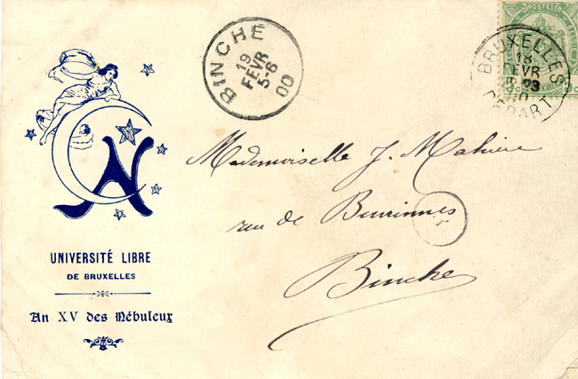
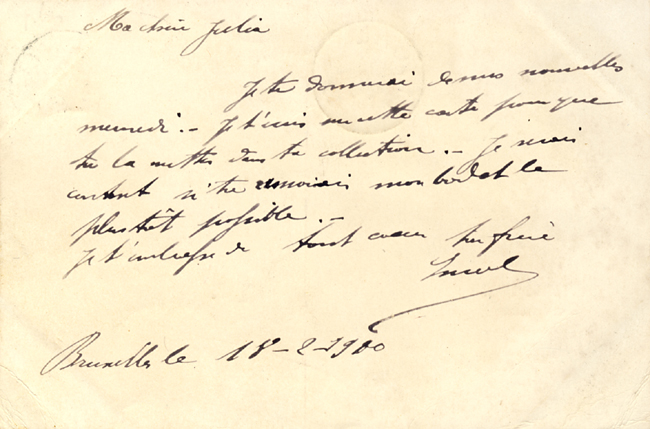
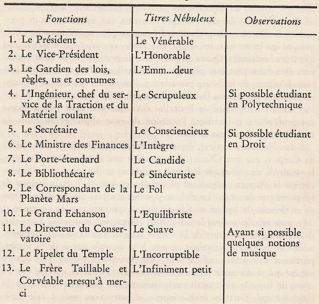

# Du Cercle 

Aux origines, le **Cercle de Bohèmes** voit le jour en 1886. Ce n'est qu'un an plus tard, en 1887, qu'il adopte le nom de **Cercle des Nébuleux**, probablement sous l'influence de confrères établis à Liège. Comme c'était souvent le cas à l'époque, il s'agit d'un cercle réunissant de jeunes bourgeois privilégiés, où la vie mondaine se mêle au réseautage. Son principal objectif est d'organiser bals, fêtes, banquets et autres divertissements. Pourtant, au-delà de son apparente légèreté, le cercle s'impose comme une institution influente, accueillant des figures marquantes telles que **George Garnir**, auteur du Semeur. Par ses rites et son décorum, il laisse une empreinte durable sur les ordres qui émergeront à l'ULB au cours du siècle suivant.

    
    

## L'organisation
L'organisation du Cercle repose sur une structure rigoureuse, comptant **strictement 13 membres**. Ce nombre, chargé de symbolisme, aurait été choisi par anticléricalisme. Chacun des membres occupe une fonction précise et se voit attribuer un titre à la fois officiel et empreint d'une certaine légèreté.  

Certaines fonctions assurent la gestion administrative et morale du Cercle, à l’image de celles que l’on retrouve dans d’autres organisations :  

- **Président**  
- **Vice-Président**  
- **Gardien des lois, règles, us et coutumes** : garant des principes moraux et du respect des traditions.  
- **Secrétaire**  
- **Ministre des finances**  
- **Grand Échanson** : chargé de la boisson.

Ainsi que d’autres fonctions, plus singulières :  

- **Pipelet du Temple** : chargé de la surveillance et de la porte d'entrée. Pipelet est probablement issus de "Mystères de Paris" de 1843.
- **Porte-étendard**  
- **Bibliothécaire**  
- **Directeur du Conservatoire**  
- **Correspondant de la Planète Mars**  
- **Ingénieur, chef du service de la Traction et du Matériel roulant**  
- **Frère Taillable et Corvéable presqu’à merci** : dernier intronisé.

> Il reste encore à établir une correspondance entre ces rôles historiques et leurs équivalents actuels.  

Un article du "Journal des Etudiants" de 1890 témoignera de la volonté de maintenir un cercle de taille restreinte : 
>  La prospérité du Cercle, toujours croissante, doit être attribuée au nombre restreint des membres qui, pour être admis, doivent compter au moins deux ans d’Université (ceci dans le but d’éloigner du Cercle l’élément gosse toujours envahissant) et obtenir l’unanimité des voix.

## L'intronisation
> 💡L'ensemble de ces informations sont tirées des mémoires de Charles Sillevaerts du nom de *"In illo tempore"* datant de 1963

Nous pouvons séparer l'intronisation nébuleuse en 3 parties distinctes. 

### La candidature

Les candidatures au sein du cercle étaient fréquentes et nombreuses. Toutefois, en raison de la limite fixée à 13 membres actifs et du souci de confier chaque fonction à une personne répondant à toutes les exigences requises, le recrutement ne se faisait pas systématiquement parmi les postulants.

Une fois sélectionnés, les candidats étaient soumis à l’examen de la **"Chambre négative"**, généralement présidée par le "Gardien des lois, règles, us et coutumes". Cette séance d’interrogation avait pour but de s’assurer que chaque postulant répondait aux attentes fixées. À l’issue de cet entretien, un vote secret à l’unanimité déterminait leur passage à la chambre suivante.

Après leur passage en « Chambre négative », les candidats sont examinés par la « Chambre affirmative », présidée par le Vice-Président, également appelé l’Honorable. Cette étape vise à confirmer que chaque postulant répond aux exigences requises (ou  **dignes entrare**). Un rapport détaillé est alors rédigé puis présenté en séance plénière pour validation. Charles Sillevaerts précise que, bien que cette étape ne fût qu’une formalité, elle était néanmoins imposée par la Règle. Une fois cette seconde chambre franchie, les candidats pouvaient être considérés comme impétrant Nébuleux 
> ⚠️ Le terme "impétrant Nébuleux" n'est pas une appellation historique et n'est pas utilisé dans la littérature.

### L'apprentissage

Lors de leur **intronisation**, les candidats devaient se soumettre à un examen médical effectué par un médecin des Nébuleux afin d’éliminer tout risque de syphilis ou de tuberculose. En effet, Charles Sillevaerts rapporte que les membres du cercle buvaient tous dans la même coupe.
Une fois cette formalité accomplie, ils étaient conviés à suivre le cours des Novices, organisé une fois par semaine du 15 novembre au 15 décembre. Ces sessions portaient principalement sur **l'étude de la "Règle"**, ainsi que sur des conférences – au nombre de quatre – dont le choix revenait au **prêcheur**.

La disposition de la salle est décrite comme suit : quatre rangées de chaises étaient disposées face à une tribune d’où s’exprimaient les "Maîtres". La première rangée était réservée aux candidats, qui disposaient d’une table pour prendre des notes. Derrière eux, au deuxième rang, se trouvaient le fauteuil du "Vénérable ""(Vice-Président) et le tabouret du "Frère Taillable et Corvéable presque à merci", c'est-à-dire le dernier intronisé.
Les membres de la Chambre affirmative occupaient le troisième rang, tandis que ceux de la Chambre négative prenaient place au dernier rang. En l’absence du Vice-Président, l’une de ses pantoufles était suspendue au-dessus de son fauteuil durant le cours et retirée pour la conférence.
Charles Sillevaerts précise que, lorsqu’ils évoquaient les fonctions des membres Nébuleux, les candidats **manifestaient leur respect** en levant la main droite. Lorsque le Vénérable était mentionné, ils devaient se retourner précipitamment et s’incliner devant lui.

> image à venir

Lors des séances secrètes, le Gardien de la Règle réprimandait les délinquants en leur touchant l’épaule avec une grande canne à pêche. Toutefois, lorsqu’il prenait place à la tribune, il déléguait ses pouvoirs ainsi que sa canne au Frère Taillable et Corvéable presque à merci. Ce dernier se voyait alors confier, à titre exceptionnel, la responsabilité de tenir le registre des dons involontaires.
Bien que ces amendes étaient minimes, leur fréquence et leur accumulation finissaient par représenter une somme conséquente. Celle-ci était intégralement versée au **"Fonds des victimes de la sécheresse"**, destiné à assurer le remplissage de la coupe. 

> 💡 Notons que les Nébuleux furent parmi les premiers à adopter un modèle de séances en deux parties : la première, secrète, était strictement réservée aux membres, tandis que la seconde, à vocation récréative, était ouverte au public.

### L'examen
En fin de cours, les candidats étaient soumis à un examen composé de trois épreuves écrites. La première portait sur les matières enseignées et devait être repassée par le candidat jusqu’à l’obtention d’une note minimale de 10 sur 20.

La seconde épreuve consistait en la résolution de deux problèmes arithmétiques **"puérils et honnêtes"**, redoutés bien souvent par les candidats. Elle était présentée devant l'"Ingénieur, chef du service du matériel roulant et de la tractation" et permettait d’obtenir un diplôme unique :

- La plus grande distinction avec baise du Président : 20
- La plus grande distinction : de 18,1 à 19,9
- La grande distinction : de 15 à 18
- La distinction : de 12,1 à 14,9
- La satisfaction : de 10,1 à 12
- L’incapacité simple : de 7,1 à 10
- L’incapacité bien établie : de 5,1 à 7
- La nullité simple : de 3,1 à 5
- La nullité pitoyable : de 0,1 à 3
- La nullité inconcevable avec consternation du Jury : 0

La troisième et dernière épreuve consistait en la rédaction d’une thèse d’au moins 80 lignes sur un sujet imposé, rédigée dans l’une des trois langues nationales ou en latin. Les candidats étaient ensuite conviés à défendre leur thèse en séance publique, sous le jugement du Vénérable, assisté des présidents des deux chambres.

### L'initiation

Après la période d'apprentissage, les candidats étaient confrontés aux épreuves d'initiation. L’une d’entre elles est mentionnée par Raymon Jaquot dans "Pour avoir évoqué les 'Nébuleux'", et consistait à passer 48 heures en habit de cérémonie, sans être autorisé à retourner chez soi, ce dernier étant surveillé.
Il était également requis de payer un tonneau de bienvenue ou de verser la somme de 7 francs au cercle.

> ⚠️ Il est difficile de reconstituer précisément l’ensemble des épreuves en raison des nombreux changements rapportés dans les différentes sources.

À la fin de son initiation, le jour de son intronisation, le nouveau Nébuleux recevait un surnom folklorique faisant référence à sa vie personnelle.
Une fois leur diplôme final obtenu, les Nébuleux accédaient automatiquement à l'honorariat et étaient invités, à « honorer les réunions de leur présence ». La Règle stipulait que ceux d’entre eux qui jouissaient d’une certaine éducation devaient offrir un tonneau de bière lors de ces occasions.

## La première guerre et les Macchabées

La Première Guerre mondiale a profondément bouleversé la composition sociale de la Belgique et du monde universitaire. L’accès aux études supérieures, autrefois réservé aux fils de bonnes familles, s’ouvre progressivement à des étudiants issus de milieux plus modestes, notamment des enfants de fonctionnaires ou d’anciens combattants.

Si ce changement en soi n’explique pas directement la disparition des Nébuleux, l’évolution des mentalités joue un rôle déterminant. L’esprit festif et les bals, jadis omniprésents, trouvent de moins en moins leur place dans une société marquée par la rigueur et la reconstruction. Dans ce contexte, prolonger ses études sur une dizaine d’années, une pratique courante parmi les membres du cercle, devient socialement mal perçu.

Une lettre datant de 1927, conservée dans les archives de l'Université, témoigne à la fois du déclin progressif du cercle et de l'organisation d'un banquet pour ses membres au sein du "Diable au corps". Il s'agit de l'une des dernières traces laissées par les Nébuleux.

>  Cher Camarade, Le cercle des Nébuleux, dont vous fûtes, nos archives en font foi, un des membres les plus dévoués, n’a pas survécu à la guerre.

> Image à venir

Selon certaines sources, les Nébuleux auraient continué à se réunir quelque temps au "Diable au Corps". Cependant, avec l’apparition des **Funèbres Macchabées**, certains membres auraient progressivement délaissé leur cercle d’origine au profit de cette nouvelle société.

# Sources : 
- Sillevaerts, C. (1963). In illo tempore ... Presses académiques européennes. Bibliothèque des sciences humaines Simone Veil
- Raymond Jacquot, « Pour avoir évoqué les « Nébuleux », Bulletin de l’Union des Anciens Etudiants, mars 1963
- L’Agenda, « Les sectes à l’ULB »