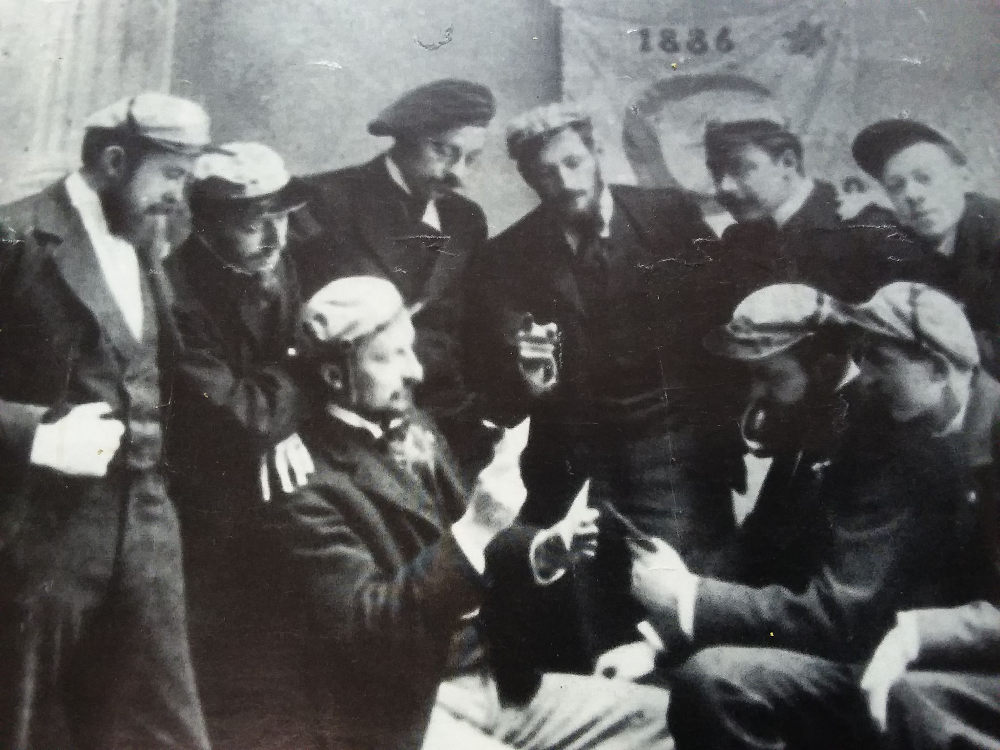

# Du Cercle 

Aux origines, le Cercle de Bohèmes voit le jour en 1886. Ce n'est qu'un an plus tard, en 1887, qu'il adopte le nom de Cercle des Nébuleux, probablement sous l'influence de confrères établis à Liège. Comme c'était souvent le cas à l'époque, il s'agit d'un cercle réunissant de jeunes bourgeois privilégiés, où la vie mondaine se mêle au réseautage. Son principal objectif est d'organiser bals, fêtes, banquets et autres divertissements. Pourtant, au-delà de son apparente légèreté, le cercle s'impose comme une institution influente, accueillant des figures marquantes telles que George Garnir, auteur du Semeur. Par ses rites et son décorum, il laisse une empreinte durable sur les ordres qui émergeront à l'ULB au cours du siècle suivant.

## L'organisation

## L'intronisation

## La première guerre et les Macchabées

# Sources : 
- 