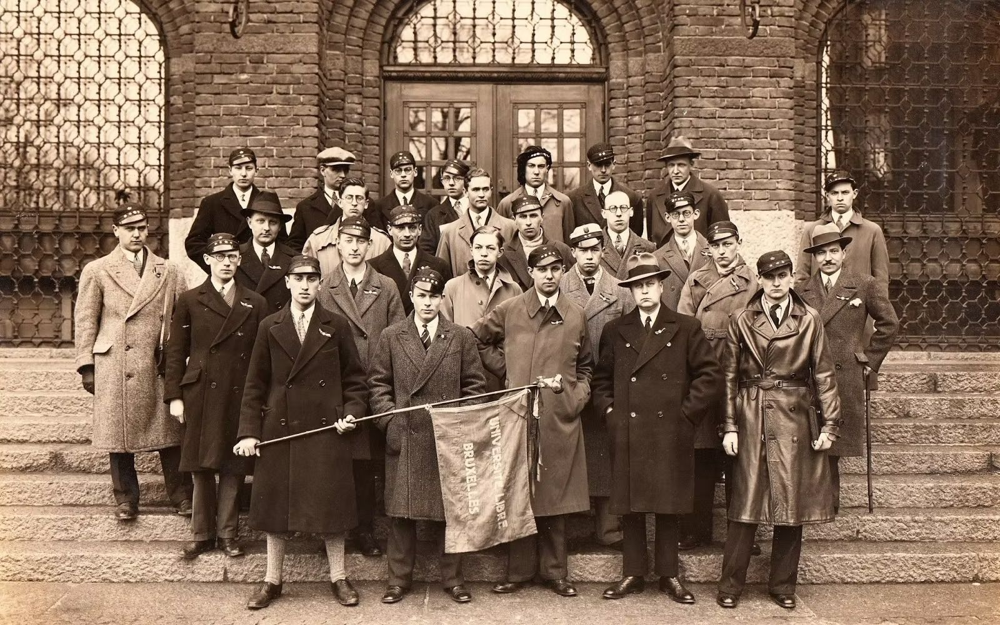

# Un rappel sur la création de l'ULB
C'est le 20 novembre 1834, que l'Université libre de Bruxelles fut inaugurée dans la salle gothique de l'hôtel de Ville. Cette initiative issue de Théodore Verhaegen et Auguste Baron, membres franc maçon du Grand Orient et des Amis Philanthropes (ainsi que du vénérable Ordre des XII) à permis l'émergence en Belgique d'une institution dédiée à l'enseignement et à la recherche, affranchie de tout dogme religieux. 
En effet, durant cette période proche de l’indépendance de la Belgique, seules trois universités d’État sous influence catholique existaient (Liège, Louvain et Gand) et la fondation de l'Université de Maline en 1834 poussa le monde libéral à réagir rapidement.

## La notion de libre examen
Le principe de Libre Examen apparait plus tard dans la vie de l'université après plusieurs affaires liant divergence d'opinions et apparition de l'université nouvelle. Le 10 juillet 1894, l'ULB modifie ainsi ses statuts pour se décrire comme : 
> "L'Université Libre de Bruxelles fonde l'enseignement et la recherche sur le principe du libre examen. Celui-ci postule, en toute matière, le rejet de l'argument d'autorité et l'indépendance de jugement"

Cette conception du libre examen, dépassant le cadre traditionnel de la recherche scientifique, se mue ici en une attitude sociale engagée, parfois combative, allant jusqu’à remettre en cause et confronter les idées d’autrui.

## La population estudiantine
Dans ses premières années et jusque dans les années 1880, l'Université libre de Bruxelles, tout comme beaucoup d'université du XIXe siècle, était une institution exclusivement masculine et uniquement accessible à une population bourgeoise. En effet, les frais de scolarité élevés, le manque de soutient financier et la préparation scolaire secondaire limitée ne permettait pas au jeunes issus de milieux  plus modeste d'accéder à l'enseignement supérieur.

> Notons le port d'une faluche par un étudiant du fonds. Le couvre-chef était probablement porté et présent avant la penne à l'ULB comme nous le montre certaines archives des Nébuleux.

# Les premiers Ordres 
Les premiers cercles et ordres à apparaitre à l'ULB sont à l'image de la population estudiantine de l'époque. Nous retrouvons ainsi des cercle permettant le réseautage facile entre les différents fils à papa et une vie à l'université plus tranquille organisée autours de banquets et de bals. Nous parlerons dans un prochain articles de ces premiers cercles tels que les Nébuleux (autrefois Bohèmes), les Adelphes etc.

## La franc-maçonnerie dans les ordres
Depuis le moment de sa création et de part les idéaux promu au sein de son enseignement, l'ULB  à vu défiler bon nombre d'enseignant notoires qui, même en conflit d'opinion politique, étaient intimement liés à la franc-maçonnerie. De cet enseignement apparut des générations d'étudiants, parfois eux-mêmes fils de maçons, empreints aux même idéaux de liberté qui, en toute logique, terminèrent leurs carrière le plus souvent au sein d'une loge Belge. 
Dans ce climat favorable, de nombreux ordres ont émergé, cherchant à reproduire le cadre discret et structuré des francs-maçons. Parmi les plus connus aujourd’hui figurent l’Ordre des Frères Macchabées et les Chevaliers du Temple, dont nous traiterons dans de prochains articles.

# Les points communs : 
Le 13e ouvrage de la série : "La pensée des Hommes - Sous le masque de la franc-maçonnerie" (source sublime ayant su susciter l'intérêt de plus d'une personne aux ordres ulbistes) relève 5 points communs entre les ordres et les rites maçonniques  : 

1. **Le Secret** : Les membres semblent observer avec rigueur le « devoir de réserve » qui leur a été inculqué dès leur admission et qui constitue un élément central de leur serment d’entrée.
2. **La Cooptation** : Les nouveaux membres doivent répondre à des critères d’admission particulièrement stricts, garantissant une certaine continuité dans le profil des candidats sélectionnés par les anciens et renforçant ainsi l’homogénéité du groupe.
3. **L'Initiation** : L'accès à un Ordre passe inévitablement par un cérémonial initiatique se référant à une symbolique spécifique.
4. **La Fraternité** : La complicité estudiantine et la camaraderie sont le plus souvent des mots d'ordre qui débouchent sur une amitié durable bien longtemps après les études.
5. **Le Rituels** : Chaque Ordre fait appel à des rites, langages et symboles différents qui donnent au groupe un caractère souvent ésotérique.

# Sources : 
- https://fr.wikipedia.org/wiki/Universit%C3%A9_libre_de_Bruxelles
- https://fr.wikipedia.org/wiki/Libre_examen
-  "La pensée des Hommes - Sous le masque de la franc-maçonnerie", 13e ouvrage.