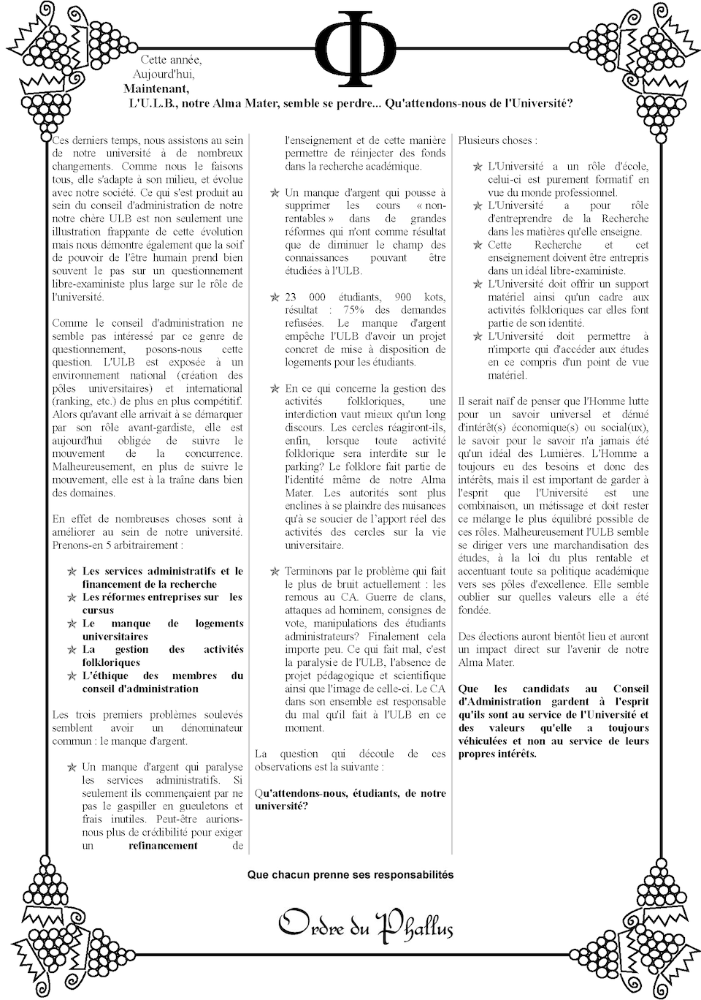
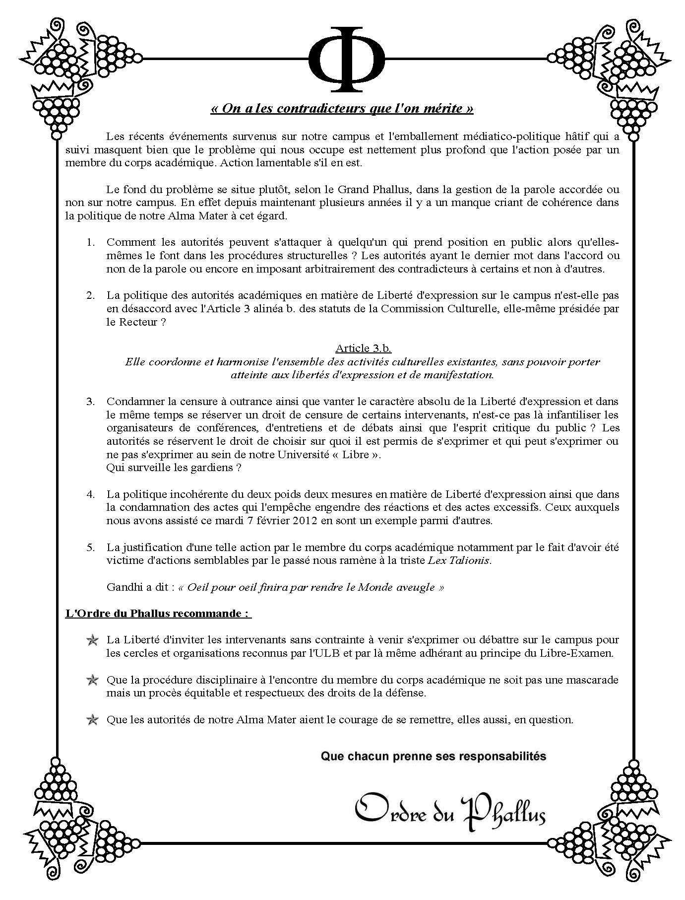

# De l'Ordre du Phallus
L'**Ordre du Phallus** (ou O.D.P) a vu le jour en 1969. D'abord simple société folklorique empreinte de légèreté, il a progressivement évolué pour devenir une véritable Confrérie, dotée de ses propres rites et symboles, inspirés du culte de Bacchus et du vin. Au fil du temps, il s'est également engagé dans la défense des valeurs de l'**Université Libre de Bruxelles (ULB)** et de la **Vrije Universiteit Brussel (VUB)**. Fait notable, cet ordre fait partie des rares, aux côtés des Hématophages, à s'étendre sur ces deux institutions académiques tout en maintenant une communication bilingue.

## Symbolisme de l'Ordre

## Rôle dans le Folklore

## Un site web
L'Ordre du Phallus a autrefois disposé d'un site web, [phallus.be](https://www.phallus.be), qui redirige désormais vers une page Google Images consacrée à la Fête du Phallus. Si cette redirection peut prêter à sourire, le site remplissait autrefois un véritable rôle de communication moderne pour la confrérie. Aujourd'hui, il est encore possible de retrouver certains articles et pages de ce site (quand on bidouille un peu) :

    
    

> Deux tracts issus du site. L'un datant du 6 mars 2015

[Ici vous trouverez une version restaurée d'une des pages web du site](phallus.htm)

# De l'Ordre de Thanéa