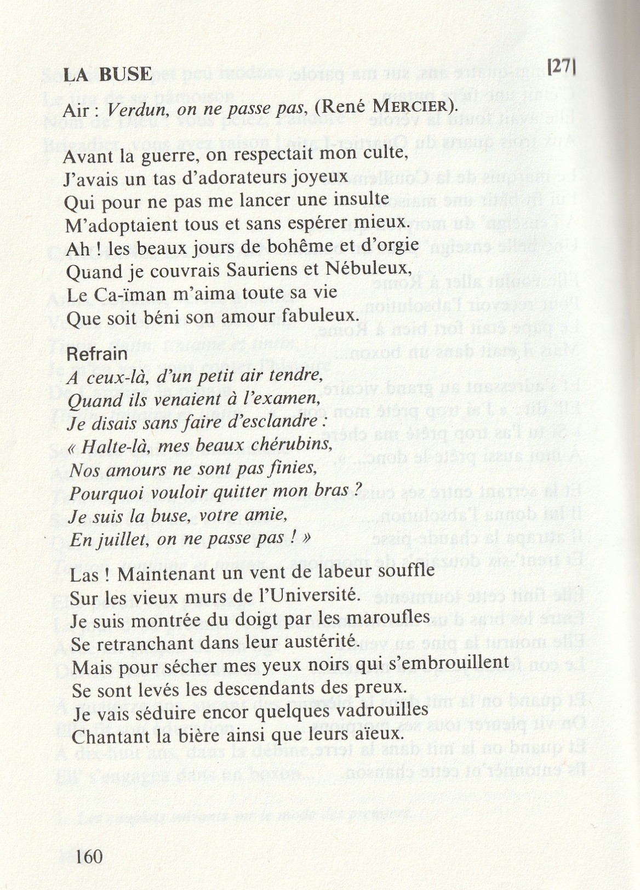

> Affiche au format a3  des Archives de l’Université libre de Bruxelles - Archive Patrimoine et Réserve précieuse

> ⚠️ L'article suivant s'appuie sur un nombre très limité de documents. En effet, il est difficile de retracer avec précision l’histoire des Sauriens. Bien que quelques références apparaissent çà et là dans divers exemplaires de Fleurs ou de journaux estudiantins de l’époque, seuls les documents suivants, issus des archives de l’ULB, ont été utilisés pour cet article, pratiquement tous signé par un "Riskosaurus Canotans" :
> -  Affichette avec un dinosaure dessinée au crayon
> -  Carte de membre (2 pièces)
> -  Menus de diner (5 pièces)
> -  Feuille et enveloppe avec l'en-tête du Cercle (3 pièces)

# De l'Origine : 
Les Sauriens, ou Saint-Synode Saurien, font leur apparition vers 1910, sans doute inspirés par la découverte des iguanodons de Bernissart par Louis Dollo. Rapidement, la société développe un univers propre, adoptant un vocabulaire et un décorum centrés sur ces grands dinosaures. Toutefois, en raison de leur ancienneté et du manque de sources les concernant, les informations disponibles restent limitées. La plupart proviennent des archives de l'ULB. Cet article s’efforcera d’en proposer une synthèse.

# De la Société : 
Les Sauriens ont laissé peu de traces de leurs activités. Toutefois, un menu de banquet de la Saint-V, conservé dans les archives de l'ULB et daté de 1912, ainsi qu’une annotation mentionnant "L’an II", permettent d’estimer la création du cercle aux alentours de 1910 ou 1911. Cependant il ne s'agit que de **supposition**.

## Le Symbolisme du Cercle
Bien que le fonctionnement interne reste difficile à déterminer, une affiche ainsi que des cartes de membres d'honneur permettent d’entrevoir certains aspects du cercle, notamment un mode de candidature par cooptation, similaire à celui des ordres actuels. De plus, des similitudes apparaissent au sein du comité, avec des postes tels que Vénérable, Synode et Grand Greffier, titres que l’on retrouvera plus tard chez les Funèbres Machabées. De manière plus générale, la présidence du cercle est assurée par le Grand Greffier.

Le cercle adopte comme symbole le **squelette d'iguanodon**, accompagné des trois points maçonniques entourés de trois "S" – probablement pour "*Saint-Synode Saurien*" – ainsi que, possiblement, la couleur mauve, si l'on se fie aux archives et à cette hypothèse concernant leur identité visuelle. Enfin, les Sauriens semblent utiliser un calendrier qui leur est propre, comme le suggère l’annotation "*15 Niclose an II*".

> Carte membre issue  des Archives de l’Université libre de Bruxelles - Archive Patrimoine et Réserve précieuse

## Le Recrutement 
Cette fameuse affiche datée de l'an II et signée des Sauriens invite les étudiants à présenter leur candidatures et nous laisse penser à une certaine ouverture du cercle malgré un mode de cooptation référencé précédemment.

Il semblerait également que le cercle distinguait les nouveaux membres des plus anciens en instaurant deux grades distincts. Le titre d'**Infect** était attribué après la réussite de l'examen d'entrée, tandis que celui de **Vénérable** était accordé après un an de stage et la réussite de l'examen correspondant.

Enfin, les "Frères" portaient des surnoms à la mode de nom de dinosaure tel que : 
- Riskausorus Cantotans
- Mamosaurus Suculens
- Commissauri Cocufactor
- Lunukausorus Timidus
- Quadros∴ Blafurens

    
    

## La disparition des Sauriens
Une mention des Sauriens en 1923 fait état d'une distribution de punch à la Saint-V, constituant l’une des dernières traces écrites du cercle. Certaines sources suggèrent toutefois que les Sauriens ont poursuivi leurs activités dans la guindaille aux côtés des Macchabées, tandis que les Nébuleux ont fini par disparaître.

> Chant La Buse. Extrait des Fleurs du Mâle édition G.R.A.C.E daté de 1983

# Sources : 
- Archive de l'ULB, fond des Sauriens - cote BE AULB ME 153
- Fleurs du Mâle édition G.R.A.C.E, UAE 1983

