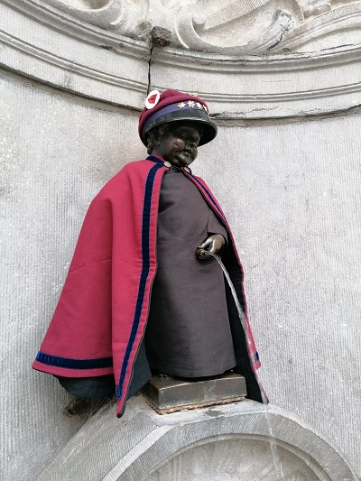
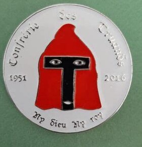

# De l'Ordre 
L' **Ordre des Frères Truands**, également appelé la **Truandaille,** voit le jour en 1951, dans le contexte de l'après-guerre. À cette époque, plusieurs ordres peinent à se restructurer. Les Frères Macchabées, par exemple, s'appuient sur le cercle de médecine pour relancer leur organisation.

Bien que marqué par une ambiance festive propre aux périodes d'après-guerre, le milieu universitaire connaît une évolution idéologique, similaire à celle observée après la Première Guerre mondiale. L'université tend alors à se "gauchiser", et la mentalité de "fils à papa" semble de moins en moins en phase avec les idéaux progressistes qui émergent parmi les étudiants des années 1940-1950.

    
    

> Manneken-Pis habillé en Coquillards, une médaille des Truands sur sa penne.
