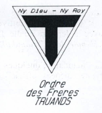

    
    

> Manneken-Pis habillé en Coquillards, une médaille des Truands sur sa penne.

# De l'Ordre des Frères Truands
L'**Ordre des Frères Truands**, également appelé la **Truandaille,** voit le jour en 1951, dans le contexte de l'après-guerre. À cette époque, plusieurs ordres peinent à se restructurer. Les Frères Macchabées, par exemple, s'appuient sur le cercle de médecine pour relancer leur organisation.

Bien que marqué par une ambiance festive propre aux périodes d'après-guerre, le milieu universitaire connaît une évolution idéologique, similaire à celle observée après la Première Guerre mondiale. L'université tend alors à se "gauchiser", et la mentalité de "fils à papa" semble de moins en moins en phase avec les idéaux progressistes qui émergent parmi les étudiants des années 1940-1950.

C’est dans ce contexte que les Frères Truands sont relancés par des membres du cercle de médecine, avec l’intention de constituer un contrepoids aux Frères Macchabées, perçus comme trop conservateurs. Selon certaines sources, ces rivalités ont donné lieu à de nombreuses confrontations, tant sur le plan idéologique que physique.
Ainsi, les deux ordres ont alterné entre revendications folkloriques et engagements politiques, souvent en décalage l’un par rapport à l’autre. Un témoignage rapporté dans *"La Pensée des hommes, sous le masque de la franc-maçonnerie"* illustre bien cette dynamique :

> [...] et le balancier de l'histoire continuant sa course, les Macchas des années 80 se mirent à défendre des positions que n'auraient pas désavouées les Truands des années 60 tandis que les Truands des années 80 renouaient avec un folklore cher aux Macchas des années 60.

## Le Symbolisme au sein de l'ordre

Depuis ses origines, l'Ordre a fondé son rituel et son symbolisme sur le Royaume d'Argot, une entité autonome et indépendante du Royaume de France apparue au XIVᵉ siècle. Ce royaume possédait son propre gouvernement, ses propres lois et son propre langage. Aujourd'hui, le terme "argot" désigne une variété linguistique propre à un groupe social ou professionnel.

> 📖 **Un mot sur l'argot**
L'argot s'est historiquement développé comme un moyen de contourner les tabous imposés par la société, permettant à divers groupes sociaux d’élaborer leur propre langage à différentes époques. L’un des premiers témoignages connus de ce phénomène apparaît dans le dossier judiciaire du procès des **Coquillards** à Dijon en 1455, où un jargon de bandits est documenté. Plus tard, au XVe siècle, **François Villon** fait référence à cette langue codée dans ses poèmes, publiés en 1489 par Levet, en employant l'expression "jargon et jobelin".

Un parallèle se dessine ainsi entre un ordre aux tendances libertaires et anarchistes et l'argot, langage du peuple, tous deux incarnant une forme de contestation de l'autorité. Cette idée se trouve parfaitement illustrée par la devise :
> Ny Dieu - Ny Roy.

Le témoignage de F. L.-T. et R. de S.-G. révèle que les Truands fondateurs de l'Ordre ont mené de nombreuses recherches, allant jusqu’à explorer la Bibliothèque Royale afin de redonner vie à des ouvrages anciens tels que :

- *"Le jargon ou langage de l'Argot réformé à l'usage des merciers, porte-balles et autres "* (1628)
- Un ouvrage anonyme datant de 1596

C’est dans le premier de ces livres que l’on retrouve un extrait récité par les Truands lors de leurs initiations :

> "... à savoir que je serai un frère pour tout Archisuppôt ou Péchon, et ce, non seulement es joyeuseté, esbaudissement et gaudisserie, mais item es malheureté; meschef et vilénie, ..."

## Le Rôle de l'Ordre
L'Ordre des Frères Truands se réunissait à huis clos, comme de nombreux autres ordres, à une date fixée, avec une présence obligatoire et, le plus souvent, dans un lieu tenu secret. Les réunions se déroulaient en deux parties : l’une dite "sérieuse" et l’autre plus festive, marquée par des libations, qui s’achevait traditionnellement avec la dernière goutte d’un tonneau, au son du **"Semeur"** et de l’**"Hymne de la Truanderie"**.

Une fois intronisés, les membres de l’Ordre recevaient un surnom symbolique, qu’ils ne devaient jamais révéler sous peine d’une sanction bibitive.

De par leur nature résolument militante, les Truands étaient fréquemment présents lors des manifestations étudiantes, mais également dans des actions plus légères et humoristiques. L’Ordre parvint à traverser le siècle en s’adaptant aux évolutions de son époque, tout en changeant à plusieurs reprises d’orientation politique. Finalement, c’est dans les années 60 qu’il prit une tournure plus revendicative que purement folklorique.

## La Disparition de l'Ordre
[X]
> Par delà ces mutations, la confrérie des Truands resta et restera fidèle à ses grands principes : pas seulement le folklore et la fraternité libertaires, mais aussi et surtout une vigoureuse défense du libre examen et du prestige de l'U.L.B

# De l'Ordre des Frères Coquillards 
L'Ordre de Frères Coquillards serait une renaissance de l'Ordre des Frères Truands dont nous faisions mention ci-dessus. C'est au début des année 90 que l'ordre se refonde à l'aide de [X]. Ils adopteront donc un cadre déjà bien défini, guidé par des idéaux similaires, tout en évoluant au fil du temps afin de mieux s'adapter à leur époque. À ce sujet, un poil de l'Ordre souligne :

> [...] nous sommes désormais très éloignés du rituel rigide et violent, que plus personne n’aime être cette structure secrète et convoitée à l’image de la franc-maçonnerie. Nous restons ce que nous sommes mais nous sommes plus une bande d’amis soudés entourés de rites plutôt que l’inverse.

## Après 10 ans de sommeil

## Le Pentagruel : Journal de Saint-V

## Le Rôle de l'Ordre
